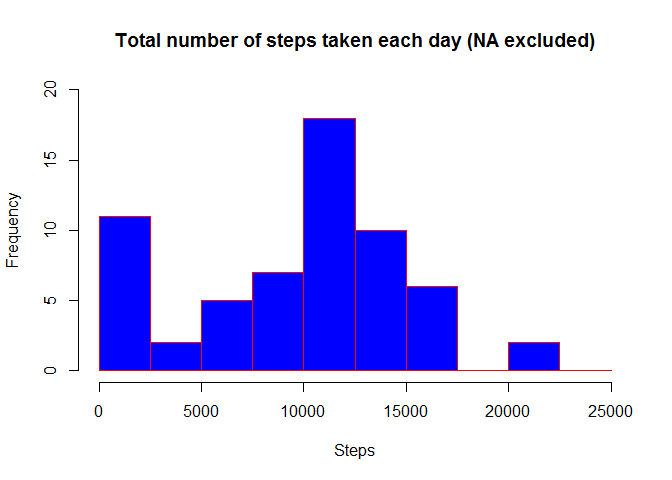
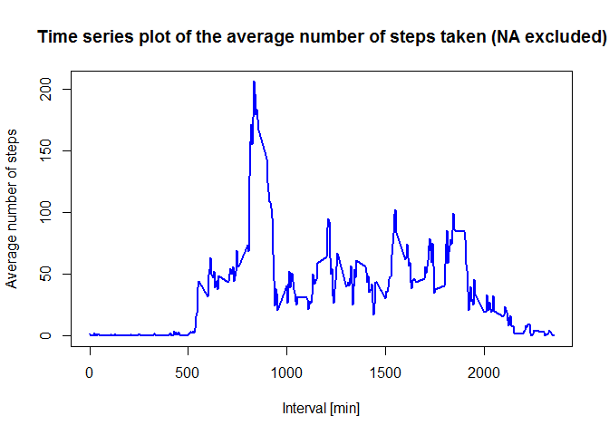
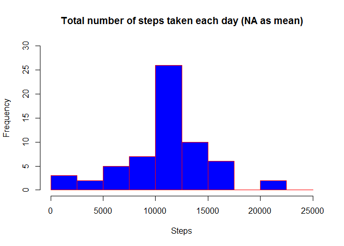
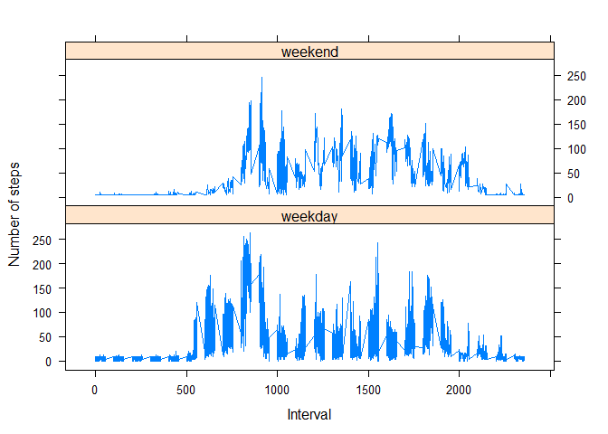

# Reproducible Research Course Project 1
Piotr Cwiklinski  
8 czerwca 2017  

## Introduction

It is now possible to collect a large amount of data about personal movement using activity monitoring devices such as a Fitbit, Nike Fuelband, or Jawbone Up. These type of devices are part of the “quantified self” movement – a group of enthusiasts who take measurements about themselves regularly to improve their health, to find patterns in their behavior, or because they are tech geeks. But these data remain under-utilized both because the raw data are hard to obtain and there is a lack of statistical methods and software for processing and interpreting the data.

This assignment makes use of data from a personal activity monitoring device. This device collects data at 5 minute intervals through out the day. The data consists of two months of data from an anonymous individual collected during the months of October and November, 2012 and include the number of steps taken in 5 minute intervals each day.

The data for this assignment can be downloaded from the course web site:

Dataset: [Activity monitoring data [52K]](https://d396qusza40orc.cloudfront.net/repdata%2Fdata%2Factivity.zip>)
The variables included in this dataset are:

* steps: Number of steps taking in a 5-minute interval (missing values are coded as NA)
* date: The date on which the measurement was taken in YYYY-MM-DD format
* interval: Identifier for the 5-minute interval in which measurement was taken
The dataset is stored in a comma-separated-value (CSV) file and there are a total of 17,568 observations in this dataset.

## Data analysis

### Loading and preprocessing the data
The data set has been dowloaded and unzipped in the folder repdata-activity in the working directory. 

0. Clear the workspace

```r
# clear the whole workspace
rm(list=ls())

# package for nice looking tables
require(knitr)
```

```
## Loading required package: knitr
```

0.1 Set the system to use english day names, settings and so on - to have weekday names displayed in English and no problems with using the R function 'weekdays'

```r
Sys.setlocale("LC_TIME", "English")
```

```
## [1] "English_United States.1252"
```

1. Load the data from the working directory

```r
activity <- read.csv("./repdata-activity/activity.csv", header = TRUE, sep = ",", na.strings = "NA")
kable(head(activity))
```


 steps  date          interval
------  -----------  ---------
    NA  2012-10-01           0
    NA  2012-10-01           5
    NA  2012-10-01          10
    NA  2012-10-01          15
    NA  2012-10-01          20
    NA  2012-10-01          25

2. Process/transform the data (if necessary) into a format suitable for analysis

```r
# Ensuring that the date column is actually in a valid data format
activity$date <- as.Date(as.character(activity$date))

# prepare the data for making time series plot
int <- aggregate(activity$steps, 
                    by=list(activity$interval), 
                    FUN=mean, 
                    na.rm=TRUE)

# name columns
names(int) <- c("interval", "average")
```


 interval     average
---------  ----------
        0   1.7169811
        5   0.3396226
       10   0.1320755
       15   0.1509434
       20   0.0754717
       25   2.0943396


### What is total number of steps taken per day (ignoring NA)?
1. Calculate the total number of steps taken per day

```r
# The total sum of steps taken each day
asum <- tapply(activity$steps, activity$date, sum,na.rm=TRUE)
```

2. Make a histogram of the total number of steps taken each day

```r
# histogram of the total number of steps taken each day
hist(asum, col = "blue", border = "red", main = "Total number of steps taken each day (NA excluded)", xlab = "Steps", breaks=seq(from=0, to=25000, by=2500), ylim=c(0, 20))
```

<!-- -->
3. Calculate and report the mean and median of the total number of steps taken per day

```r
# mean of steps taken each day
amean <- mean(asum)
# median of steps taken each day
amedian <- median(asum)
```
The mean is equal to 9354.2295082 and median to 10395.

## What is the average daily activity pattern?
1. Make a time series plot (i.e. type = "l") of the 5-minute interval (x-axis) and the average number of steps taken, averaged across all days (y-axis)

```r
# plot the data
plot(int$interval, 
     int$average, 
     type="l", 
     col="blue", 
     lwd=2, 
     xlab="Interval [min]", 
     ylab="Average number of steps", 
     main="Time series plot of the average number of steps taken (NA excluded)")
```

<!-- -->

2. Which 5-minute interval, on average across all the days in the dataset, contains the maximum number of steps?

```r
# finding the maximum and its corresponding interval
max <- int[int$average==max(int$average),]
```
The maximum number of steps is 206.1698113 and its corresponding 5-minute interval is 835.

### Imputing missing values
Note that there are a number of days/intervals where there are missing values (coded as NA). The presence of missing days may introduce bias into some calculations or summaries of the data.

1. Calculate and report the total number of missing values in the dataset (i.e. the total number of rows with NAs)

```r
# count NAs in the activity data set
count <- sum(is.na(activity))
```
The number of missing data (NA) is equal to 2304.

2. Devise a strategy for filling in all of the missing values in the dataset. The strategy does not need to be sophisticated. For example, you could use the mean/median for that day, or the mean for that 5-minute interval, etc.

I will replace missing values with the mean using the R package zoo.

```r
# package for replacing NA with some value
require(zoo)
```

```
## Loading required package: zoo
```

```
## 
## Attaching package: 'zoo'
```

```
## The following objects are masked from 'package:base':
## 
##     as.Date, as.Date.numeric
```

3. Create a new dataset that is equal to the original dataset but with the missing data filled in.
Then one can use the na.aggregate function and replace NA, here with the mean

```r
# replace NAs with mean
activity$steps <- na.aggregate(activity$steps)
```

4. Make a histogram of the total number of steps taken each day and Calculate and report the mean and median total number of steps taken per day. Do these values differ from the estimates from the first part of the assignment? What is the impact of imputing missing data on the estimates of the total daily number of steps?

```r
# sum of steps taken each day
asumNA <- tapply(activity$steps, activity$date, sum)

# histogram of the total number of steps taken each day with NA replaced by mean
hist(asumNA, col = "blue", border = "red", main = "Total number of steps taken each day (NA as mean)", xlab = "Steps", breaks=seq(from=0, to=25000, by=2500), ylim=c(0, 30))
```

<!-- -->


```r
# mean of steps taken each day
ameanNA <- mean(asumNA)
# median of steps taken each day
amedianNA <- median(asumNA)
```
Now, the mean is equal to 1.0766189\times 10^{4} and median to 1.0766189\times 10^{4}. Please note that values are different than that calculated when missing values (NAs) were ignored. The impact of imputing the missing values is to have more data, hence to obtain a bigger mean and median value.

### Are there differences in activity patterns between weekdays and weekends?
I will use the dataset with NAs filled with mean below

1. Create a new factor variable in the dataset with two levels – “weekday” and “weekend” indicating whether a given date is a weekday or weekend day.

```r
# first I add the column with weekdays names to the data using weekdays function
activity$weekday <- weekdays(activity$date)
kable(head(activity))
```


   steps  date          interval  weekday 
--------  -----------  ---------  --------
 37.3826  2012-10-01           0  Monday  
 37.3826  2012-10-01           5  Monday  
 37.3826  2012-10-01          10  Monday  
 37.3826  2012-10-01          15  Monday  
 37.3826  2012-10-01          20  Monday  
 37.3826  2012-10-01          25  Monday  

```r
# then, I add the category weekend or weekday based on the day name (for this I needed local setting to be display days names in English)
activity$type <- ifelse(activity$weekday == "Saturday" | 
                                activity$weekday == "Sunday", "weekend", 
                        "weekday")
# prepare the data
int2 <- aggregate(activity$steps, 
                       by=list(activity$type, 
                               activity$weekday, activity$interval), mean)

# name columns
names(int2) <- c("type", "weekday", "interval", "average")
```
Some rows of the data with NAs replaced by mean


type      weekday     interval    average
--------  ---------  ---------  ---------
weekday   Friday             0   8.307244
weekday   Monday             0   9.418356
weekend   Saturday           0   4.672825
weekend   Sunday             0   4.672825
weekday   Thursday           0   9.375844
weekday   Tuesday            0   0.000000


2. Make a panel plot containing a time series plot (i.e. type = "l") of the 5-minute interval (x-axis) and the average number of steps taken, averaged across all weekday days or weekend days (y-axis). See the README file in the GitHub repository to see an example of what this plot should look like using simulated data.

I will use the R package lattice

```r
require(lattice)
```

```
## Loading required package: lattice
```

```r
# time serie plots
xyplot(average ~ interval | type, int2, 
       type="l", 
       lwd=1, 
       xlab="Interval", 
       ylab="Number of steps", 
       layout=c(1,2))
```

<!-- -->
